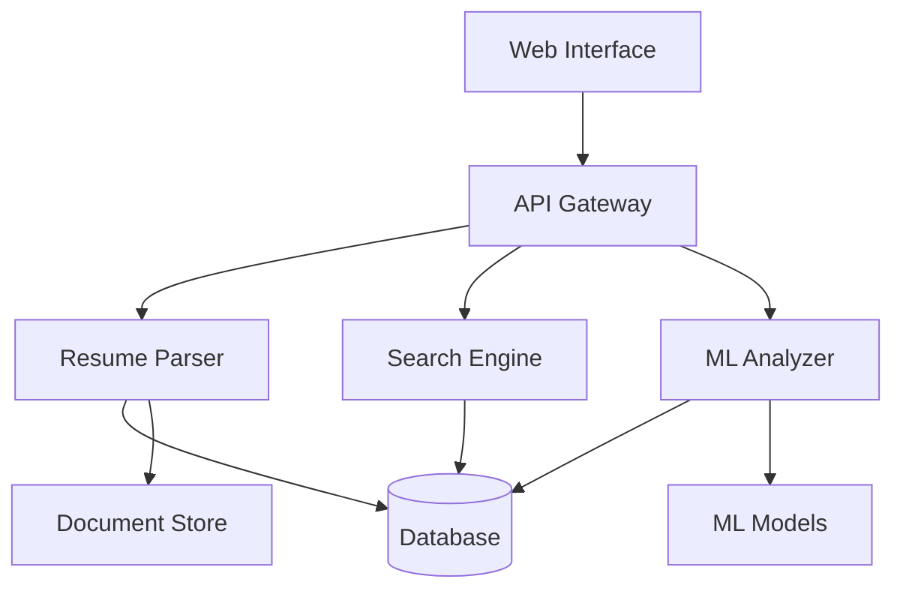

<h1 align="center">
  <a href="http://www.amitmerchant.com/electron-markdownify"></a>
</h1>

# 📄 Resume Filtering System

## 🎯 Overview

A sophisticated AI-powered resume filtering and candidate management system designed to streamline the recruitment process. Leveraging natural language processing and machine learning algorithms to automatically screen, rank, and match candidates with job requirements.

## ✨ Key Features

🤖 **AI-Powered Analysis**
- Smart resume parsing
- Skill matching algorithms
- Experience level assessment
- Education verification

📊 **Candidate Scoring**
- Customizable scoring criteria
- Automated ranking system
- Skills relevancy matching
- Experience weighting

🔍 **Advanced Search**
- Full-text search capabilities
- Filter by multiple criteria
- Boolean search support
- Keyword highlighting

📈 **Analytics Dashboard**
- Recruitment funnel metrics
- Candidate source tracking
- Time-to-hire analytics
- Quality of hire metrics

## 🛠️ Tech Stack

### 🎯 Backend
- **🐍 Python**: Core application
- **🧠 TensorFlow**: ML models
- **📚 spaCy**: NLP processing
- **🗄️ PostgreSQL**: Database
- **🔄 Redis**: Caching
- **🌐 FastAPI**: REST API

### 💻 Frontend
- **⚛️ React**: Web interface
- **📊 D3.js**: Data visualization
- **🎨 Tailwind CSS**: Styling
- **🔐 Auth0**: Authentication

## 🏗️ System Architecture



## ⚙️ Prerequisites

- 🐍 Python 3.9+
- 📦 Node.js 18+
- 🐘 PostgreSQL 13+
- 🔄 Redis 6+
- 🐳 Docker

## 🚀 Installation

1. 📥 **Clone the repository**
```bash
git clone https://github.com/your-organization/resume-filtering-system.git
cd resume-filtering-system
```

2. 🔧 **Set up virtual environment**
```bash
python -m venv venv
source venv/bin/activate  # Linux/Mac
.\venv\Scripts\activate   # Windows
```

3. 📚 **Install dependencies**
```bash
# Backend
pip install -r requirements.txt

# Frontend
cd frontend
npm install
```

4. 🗄️ **Configure database**
```bash
# Setup PostgreSQL
createdb resume_filter
python manage.py migrate
```

5. 🚀 **Launch application**
```bash
# Start backend
uvicorn main:app --reload

# Start frontend
cd frontend
npm start
```

## 💡 Usage Guide

### 🎯 Resume Upload
```python
POST /api/v1/resumes
Content-Type: multipart/form-data
```

### 🔍 Search API
```python
GET /api/v1/search
Parameters:
- query: str
- filters: dict
- page: int
- limit: int
```

### 📊 Analytics API
```python
GET /api/v1/analytics
Parameters:
- start_date: date
- end_date: date
- metrics: list
```

## 📊 Performance Metrics

⚡ **System Capabilities**
- Processing Speed: 100 resumes/minute
- Search Response Time: <200ms
- Accuracy Rate: 95%+ for skill matching
- Scalable to 1M+ resumes

## 🔐 Security Features

- 🔒 End-to-end encryption
- 🔑 Role-based access control
- 📝 Audit logging
- 🛡️ Rate limiting
- 🔐 Data anonymization

## 📂 Project Structure

```
📁 resume-filter/
├── 🐍 backend/
│   ├── 📄 api/
│   ├── 🤖 ml/
│   ├── 🔍 search/
│   └── 📊 analytics/
├── ⚛️ frontend/
│   ├── 📱 components/
│   ├── 📄 pages/
│   └── 🎨 styles/
└── 🔧 config/
```

## 🧪 Testing

```bash
# Run backend tests
pytest

# Run frontend tests
npm test
```

## 📈 API Documentation

Interactive API documentation available at:
```
http://localhost:8000/docs
```

## 🤝 Contributing

1. 🔱 Fork the repository
2. 🌿 Create your feature branch
3. 💾 Commit your changes
4. 📤 Push to the branch
5. 🎯 Create a Pull Request

## 📜 License

Licensed under the MIT License. See `LICENSE` for more information.

## 💬 Support & Contact

Need help? We've got you covered!

📧 **Email Support**: youssefouhba@gmail.com  
📚 **Documentation**: https://quickref.me/  
🐛 **Issue Tracking**: https://quickref.me/  
💭 **Community Chat**: https://app.daily.dev/

## 🌟 Acknowledgments

- 🙏 Thanks to all contributors
- 📚 Built with open-source libraries
- 🤖 Powered by cutting-edge ML models

---

⭐ Star us on GitHub if you find this project useful!

---
<div align="center">
  Made with ❤️ in Morocco
</div>
